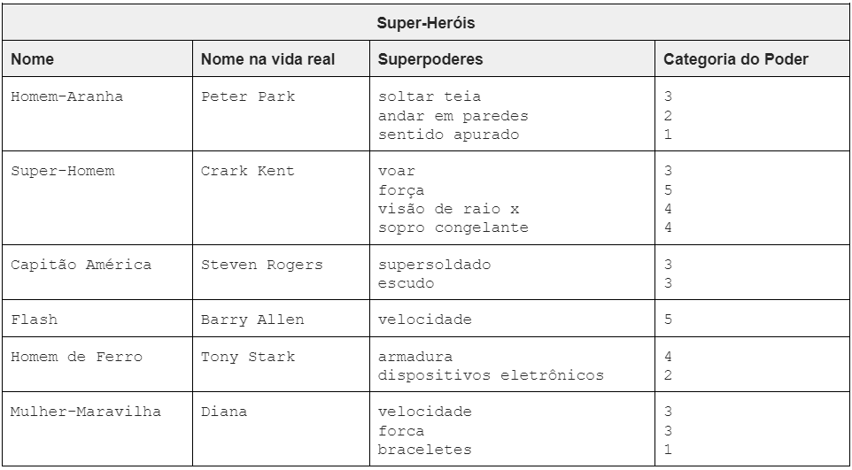
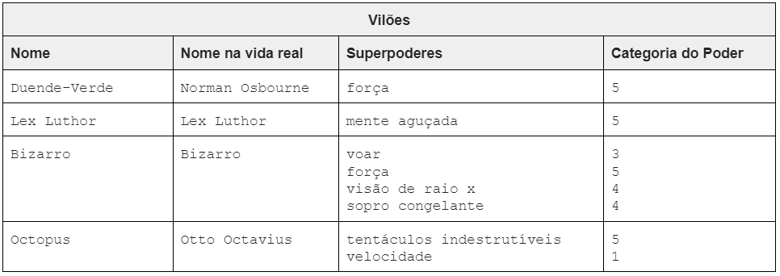

# Exercício de Casa 🏠 

> ATENÇÃO: Antes de criar cada classe em código, **crie um diagrama UML** para cada uma delas seguindo as características descritas.
>
>Os diagramas podem ser criados:
> - No papel: nesse caso, tire fotos e coloque na pasta da sua resolução.
> - Digital, utilizando algum site tipo https://lucid.app/: nesse caso, tire print da tela ou salve os diagramas e anexe-os na sua resolução.

### Batalha de Super-heróis
Na lista abaixo são citados alguns super-heróis e alguns vilões, dos quais provavelmente já ouvimos falar. A lista apresenta também o nome na vida real e os superpoderes de cada um. Os superpoderes foram categorizados de 1 a 5, sendo 5 o poder mais forte e 1 o poder mais fraco.

### SuperPoder
Defina uma classe para um objeto `SuperPoder`.
Deve possuir as seguintes propriedades:
- [ ] `nome`: Nome do Poder
  - Recebido por parâmetro durante a instanciação.
  - Deve ser um parâmetro privado
  - Deve ter um método get
- [ ] `categoria`: Categoria do Poder
  - Recebido por parâmetro durante a instanciação.
  - Deve ser um parâmetro privado.
  - Deve ter um método get

### Personagem
Defina uma classe para um objeto `Personagem`.
Deve possuir as seguintes propriedades:
- [ ] `nome`: Nome do Personagem
  - Recebido por parâmetro durante a instanciação.
  - Deve ser um parâmetro privado
  - Deve ter um método get
- [ ] `nomeVidaReal`: Nome Vida Real do Personagem
  - Recebido por parâmetro durante a instanciação.
  - Deve ser um parâmetro privado.
  - Deve ter um método get
- [ ] `poderes`: Lista de Poderes
  - Deve ser inicializado vazio.
  - Deve ser um parâmetro privado.

- Métodos da classe `Personagem`:
  - [ ] `adicionaSuperPoder`: adiona super poder a lista de poderes
   - recebe um superpoder do tipo `SuperPoder` como parâmetro e coloca-o na lista de poderes. 
   - Um super-herói ou vilão pode ter, no máximo, 4 poderes
  - [ ] `poderTotal`: retorna a soma de poderes do super-herói.
   - O poder total é calculado percorrendo-se a lista de poderes e somando a categoria de cada poder.

>❌ **A SER IMPLEMENTADO APENAS NA PROXIMA SEMANA** ❌
> ### SuperHeroi
> Defina uma classe para um objeto `SuperHeroi` que herda da classe `Personagem`
>  - Metodo `poderTotal`: retorna o poder do personagem super-herói com um acréscimo de 10%.

>❌ **A SER IMPLEMENTADO APENAS NA PROXIMA SEMANA** ❌
> ### Vilao
> Defina uma classe para um objeto `Vilao` que herda da classe `Personagem`
> Deve possuir as seguintes propriedades:
> - [ ] `tempoDePrisao`: Tempo de prisao do vilão
>   - Recebido por parâmetro durante a instanciação.
>   - Deve ser um parâmetro publico
>   - Deve ter um método get

### Confronto
Defina uma classe para um objeto `Confronto`.
Deve possuir os seguintes métodos:
 - [ ] `lutar`: luta entre vilão e superheroi
  - recebe um super-herói e um vilão como parâmetros e decide quem é o vencedor da batalha
  - O método deve retornar:
    - 1: se o super-herói ganha a batalha
    - 2: se o vilão ganha a batalha
    - 0: se houver empate.
  - O vencedor será aquele que tiver mais poder total
  - metodo publico

Teste tudo o que foi criado.

---

Terminou o exercício? Dá uma olhada nessa checklist e confere se tá tudo certinho, combinado?!

- [ ] Fiz o fork do repositório.
- [ ] Clonei o fork na minha máquina (`git clone url-do-meu-fork`).
- [ ] Criei minha branch (` git checkout -b nome-sobrenome `)
- [ ] Criei a pasta com o meu nome dentro da pasta entregas (` mkdir nome-sobrenome`)
- [ ] Resolvi o exercício dentro da minha pasta. Como no [exemplo](./entregas/exemplo-nome-sobrenome/).
- [ ] Adicionei as mudanças. (`git add .` para adicionar todos os arquivos, ou `git add nome_do_arquivo` para adicionar um arquivo específico)
- [ ] Commitei a cada mudança significativa ou na finalização do exercício (`git commit -m "Mensagem do commit"`)
- [ ] Pushei os commits na minha branch (`git push origin nome-da-branch`)
- [ ] Criei um Pull Request seguindo as orientações que estao nesse [documento](./instrucoes-pull-request.md).
